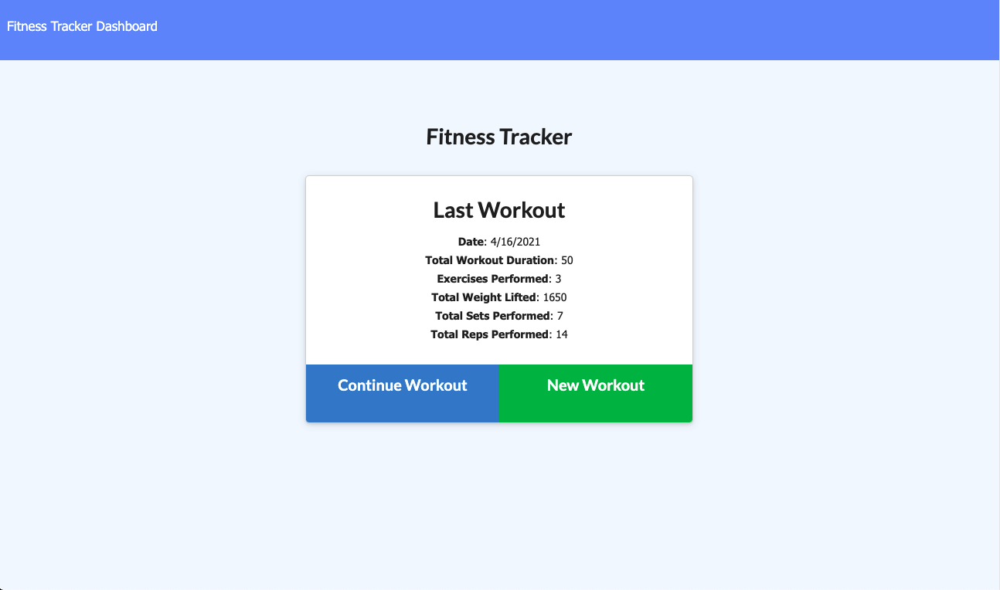

# Fitness-Tracker

## Deployed Link

[Live Link](https://rocky-waters-93224.herokuapp.com/)

## Table of Contents

* [Purpose](#Purpose)

* [Technologies](#Technologies)

* [Installation](#Installation)

* [Contact](#Contact)

* [License](#License)

## Purpose

An application that allows the user to input new workouts and complete previous workouts. Once done, clicking to the dashboard the user will be able to see their workout stats from the previous seven days. Clicking on a certain workout in either the duration or workout will alter the chart and reflect changes. 

## Technologies

* ***Nodejs***
* ***noSQL***
* ***Dotenv***
* ***mongo***
* ***BootStrap*** 
* ***Express*** 
* ***JavaScipt***
* ***CSS***
* ***HMTL***
* ***API***

## Installation

The live deployed app will take care of the user (no instructions needed)

However if it was needed to run the application locally:

1. Clone the repository on a local machine.
2. Open the apps directory and run a `npm install` to get all dependencies.
3. Create an `.env` file that will store your personal credentials. Follow the `.env.EXAMPLE` model to ensure correct key/value pairs for the MONGODB_URI connection strings
4. In the command line run `npm run start` to get the server up and running, from there navigate to a browser of choice and access the app by going to `localhost:3001`.
5. If need to seed run `npm run seed`

## Contact

* [Email](mailto:josephjlyons90@gmail.com)
* [LinkedIn](www.linkedin.com/in/joseph-lyons-0a2630200/)

## License

Copyright (c) [2021] [Joseph Lyons]
Permission is hereby granted, free of charge, to any person obtaining a copy of this software and associated documentation files (the "Software"), to deal in the Software without restriction, including without limitation the rights to use, copy, modify, merge, publish, distribute, sublicense, and/or sell copies of the Software, and to permit persons to whom the Software is furnished to do so, subject to the following conditions:

The above copyright notice and this permission notice shall be included in all copies or substantial portions of the Software.

THE SOFTWARE IS PROVIDED "AS IS", WITHOUT WARRANTY OF ANY KIND, EXPRESS OR IMPLIED, INCLUDING BUT NOT LIMITED TO THE WARRANTIES OF MERCHANTABILITY, FITNESS FOR A PARTICULAR PURPOSE AND NONINFRINGEMENT. IN NO EVENT SHALL THE AUTHORS OR COPYRIGHT HOLDERS BE LIABLE FOR ANY CLAIM, DAMAGES OR OTHER LIABILITY, WHETHER IN AN ACTION OF CONTRACT, TORT OR OTHERWISE, ARISING FROM, OUT OF OR IN CONNECTION WITH THE SOFTWARE OR THE USE OR OTHER DEALINGS IN THE SOFTWARE.
